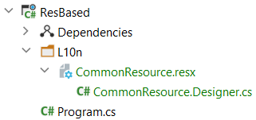
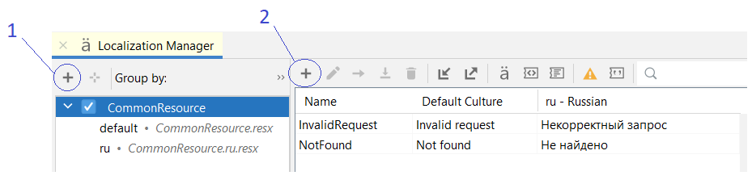
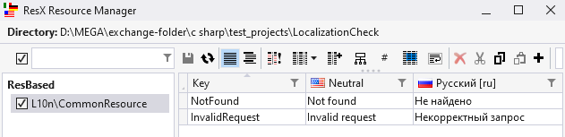
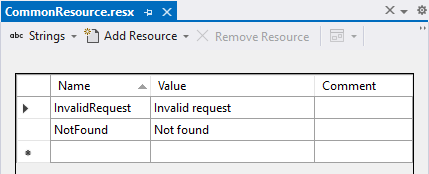

# Особенности работы с res-файлами

[learn.microsoft - Ресурсы в приложениях .NET](https://learn.microsoft.com/ru-ru/dotnet/core/extensions/resources)

## Ресурсный файл по умолчанию

Допустим надо локализовать две строки:

- "Не найдено"
- "Некорректный запрос"

Это строки, которые можно использовать повсеместно, поэтому название для ресурсного файла будет "CommonResource".

Первым делом надо создать **ресурсный файл по умолчанию**, иногда его еще называют **основной файл ресурсов**:

1. Определение того, какую локализацию будет содержать ресурсник по умолчанию, является чисто организационным мероприятием.
2. Обычной принимается, что ресурсник по умолчанию содержит локализации для английского языка.

Создам ресурсник по умолчанию в папке `L10n` и заполню его локализованными строками на английском языке:  


здесь:

- **CommonResource.resx** - xml файл ресурсника
- **CommonResource.Designer.cs** - создается автоматически. Экспортирует класс `CommonResource` - именно этот класс будем использовать в коде для доступа к локализации

При добавлении основного файла ресурсов одновременно в файл проекта добавились записи:

```xml
<Project Sdk="Microsoft.NET.Sdk">
  ...
  <ItemGroup>
    <EmbeddedResource Update="L10n\CommonResource.resx">
      <Generator>ResXFileCodeGenerator</Generator>
      <LastGenOutput>CommonResource.Designer.cs</LastGenOutput>
    </EmbeddedResource>
  </ItemGroup>

  <ItemGroup>
    <Compile Update="L10n\CommonResource.Designer.cs">
      <DesignTime>True</DesignTime>
      <AutoGen>True</AutoGen>
      <DependentUpon>CommonResource.resx</DependentUpon>
    </Compile>
  </ItemGroup>
</Project>
```

**Важно!** Ресурсник по умолчанию используется, если dotnet не может найти ресурсник для текущей культуры приложения.  
Например, в программе предполагается использовать 4 языка: **en** (по умолчанию), **ru**, **de**, **es**.  
Ресурсники для языков: **ru**, **de**, **es** - будут выбраны dotnet, только, если текущая культура совпадет с одним из них.  
А вот ресурсник по умолчанию будет выбран для культуры **en**, также он будет выбран для культуры **fr** или для вообще любой культуры, отличной от **ru**, **de**, **es**.

**Важно!** Один раз выбрав для ресурсника по умолчанию, например, английский язык, приведет к тому, что содержимое всех других ресурсников-по-умолчанию придется также наполнять английским переводом. Потом поменять на другой язык во всех ресурсниках по умолчанию может оказаться трудоемким занятием.

# Локализованный файл ресурсов

При добавлении локализованных ресурсов:

1. Указывайте для них тоже имя файла, что и для ресурсного файла по умолчанию
2. Также в имени файла необходимо указать культуру

В нашем случае ресурсный файл по умолчанию: `CommonResource.resx` - и он содержит локализацию для английского языка.  
Допустим, теперь я хочу добавить локализацию для русского языка, значит мне надо создать ресурсный файл с именем `CommonResource.ru`:  


здесь:

- **CommonResource.resx** - xml файл ресурсника по умолчанию
- **CommonResource.Designer.cs** - создается автоматически. Экспортирует класс `CommonResource` - именно этот класс будем использовать в коде для доступа к локализации
- **CommonResource.ru.resx** - xml файл ресурсника с локализациями для культуры `ru`

Итак, при текущей конфигурации, если культура совпадает с `ru`, то локализации будут браться из ресурсника `CommonResource.ru.resx`, для всех остальных культур локализации будут браться из ресурсника `CommonResource.resx`, а в нашем примере он содержит локализации для английского языка.

# Редакторы ресурсных файлов

## Rider

Для его вызова надо в верхнем меню вызвать: **Tools** ➔ **Localization Manager**:  


здесь:

- по кнопке 1 можно добавить Локализованный файл ресурсов
- по кнопке 2 можно редактировать локализованные строки. Причем будет гарантирован контроль, что во всех файлах ресурсов будет одинаковый состав и содержимое ключей

## ResXResourceManager

[ResXResourceManager](https://github.com/dotnet/ResXResourceManager) функциональностью может даже превосходить редактор Rider'а:



## Visual Studio

В Visual Studio файлы ресурсов редактируются по отдельности:



Раздельное реадктирование может привести к ситуации, когда в одном ресурснике ключ локализации есть, а в другом он отсутствует.

# Использование ресурса в другом проекте

1. В настройках ресурса по умолчанию (ПКМ-Properties), в поле **Custom tool** надо сменить значение с `ResXFileCodeGenerator` на `PublicResXFileCodeGenerator`.
2. Перегенерить ресурсник. В Rider это делается через меню по ПКМ, пункт **Generate resources**. Либо можно запустить проект, тогда dotnet сам все перегенерит.

Для рассматриваемого примера, после проделанных действий, класс `CommonResource`, который определен в файле `CommonResource.Designer.cs`, сменит модификатор с **internal** на **public**.
