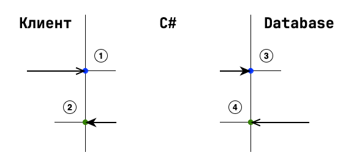

# DateTime

[ISO 8601](https://en.wikipedia.org/wiki/ISO_8601)

- [Choose between DateTime, DateOnly, DateTimeOffset, TimeSpan, TimeOnly, and TimeZoneInfo](https://learn.microsoft.com/en-us/dotnet/standard/datetime/choosing-between-datetime)
- [Потеря Kind при сохранении в БД](./kind-set-on-reading-from-db.md)
- Конвертации .NET <-> Database:
  - [MSSQL. time, date, datetime, datetime2, datetimeoffset](mssql-time-date-datime-datime2-datetimeoffset.md)
  - [PostgreSQL. time, date, timestamp, timestamptz, interval](postgresql-time-date-timestamp-timestamptz-interval.md)
- [Duration](https://en.wikipedia.org/wiki/ISO_8601#Durations)
  - [Iso8601DurationHelper](https://www.nuget.org/packages/Iso8601DurationHelper)
  - [Microsoft.Graph.Duration](https://learn.microsoft.com/en-us/dotnet/api/microsoft.graph.duration)
  - [Noda Time](https://stackoverflow.com/questions/74155954/how-can-i-parse-iso-8601s-pndtnhnmn-ns-format-in-c-net#answer-74156166)

## Time Zone

Оба, и MSSQL и PostgreSQL, дают возможность сохранить **offset** – смещение относительно UTC.  
Но этого **недостаточно** для точной работы с временными зонами.  
Time Zone – это не смещение, а скорее часовой пояс с учетом перехода на летнее время. Для одной временной зоны смещение может меняться в зависимости от: времени года, от года. Обозначается строковым идентификатором [TZ identifier](https://en.wikipedia.org/wiki/List_of_tz_database_time_zones).  
Пример работы с временными зонами: [When “UTC everywhere” isn’t enough - storing time zones in PostgreSQL and SQL Server](https://www.roji.org/storing-timezones-in-the-db)

## О некоторых типах

**DateTime** – это объект для хранения даты/времени, относящихся к Локальному времени или же к UTC (это определяется значением свойства Kind).  
**DateTimeOffset** - тоже, что и DateTime, только еще и смещение хранит.

## Алгоритм



### 1 - Входящие данные от клиента

- Как происходить парсинг/десериализация даты и времени?

На сервере с локальным offset +03:00 десериализация выглядит так:

```csharp
DateTime.Parse("2023-07-30T10:42:18Z");      // 30.07.2023 13:42:18
DateTime.Parse("2023-07-30T10:42:18+7");
DateTime.Parse("2023-07-30T10:42:18+07:00"); // 30.07.2023 06:42:18 - конвертнулось относительно локального времени сервера!

DateTimeOffset.Parse("2023-07-30T10:42:18.538Z");      // 30.07.2023 10:42:18 +00:00
DateTimeOffset.Parse("2023-07-30T10:42:18.538+3");
DateTimeOffset.Parse("2023-07-30T10:42:18.538+03:00"); // 30.07.2023 10:42:18 +03:00 
```

#### Если можно задать ограничение, что сервер принимает дату/время только в UTC

- с клиента дата/время должна приходить c "Z" на конце
  - если пришло с offset, то бросать исключение?
- гарантированная потеря информации о смещении клиентского времени. Правда, смещение еще хранить надо и как-то с ним потом работать

#### Если клиент может прислать offset и это ожидаемое поведение

- парситься должно в DateTimeOffset 
