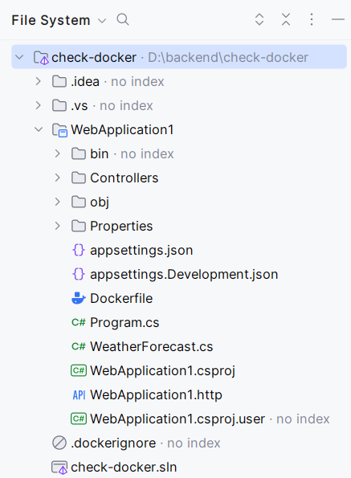

# Деплой

## Индивидулаьный докер

[Пакуем приложения ASP.NET Core с помощью Docker](https://habr.com/ru/companies/microsoft/articles/435914/)  
[Secure your container build and publish with .NET 8](https://devblogs.microsoft.com/dotnet/secure-your-container-build-and-publish-with-dotnet-8/)

[dotnet publish](https://learn.microsoft.com/ru-ru/dotnet/core/tools/dotnet-publish)  
[dotnet build](https://learn.microsoft.com/ru-ru/dotnet/core/tools/dotnet-build)  
[Publish .NET apps with the .NET CLI](https://learn.microsoft.com/en-us/dotnet/core/deploying/deploy-with-cli)

[Understand build configurations](https://learn.microsoft.com/en-us/visualstudio/ide/understanding-build-configurations)  
[Справочник по MSBuild для проектов пакета SDK для .NET](https://learn.microsoft.com/ru-ru/dotnet/core/project-sdk/msbuild-props#useapphost)



Dockerfile:

```dockerfile
FROM mcr.microsoft.com/dotnet/sdk:8.0 AS publish
ARG BUILD_CONFIGURATION=Release
WORKDIR /src
COPY ["WebApplication1", "WebApplication1"]
RUN dotnet restore "./WebApplication1/WebApplication1.csproj"
WORKDIR "/src/WebApplication1"
RUN dotnet publish "./WebApplication1.csproj" -c Release -r linux-x64 -o /app/publish /p:UseAppHost=false
#RUN dotnet publish "./WebApplication1.csproj" -c Release -r linux-x64 -o /app/publish --self-contained false  

FROM mcr.microsoft.com/dotnet/aspnet:8.0 AS final
USER app
EXPOSE 8080
WORKDIR /app
COPY --from=publish /app/publish .
ENTRYPOINT ["dotnet", "WebApplication1.dll"]
```

Сборка docker-образа:

```shell
docker build -f .\WebApplication1\Dockerfile --target final --build-arg "BUILD_CONFIGURATION=Release" --tag build:dev .
docker build -f .\WebApplication1\Dockerfile --output type=local,dest=./output --target final --build-arg "BUILD_CONFIGURATION=Release" --tag build:dev .
```

## Проверять на linux с докером

1. [установить докер в докере docker:dind](https://medium.com/@shivam77kushwah/docker-inside-docker-e0483c51cc2c)

```shell
docker pull docker:dind
docker run --privileged --name my-dind-container -d docker:dind
docker exec -it my-dind-container docker date
```

2. [Установить sdk на AlpineLinux](https://learn.microsoft.com/en-us/dotnet/core/install/linux-alpine#install-net-8), [не забыть! про депенденси для AlpineLinux](https://learn.microsoft.com/en-us/dotnet/core/install/linux-alpine#dependencies)

3. [Создать солюшен](https://learn.microsoft.com/en-us/dotnet/core/tools/dotnet-sln), [проект по шаблону](https://learn.microsoft.com/en-us/dotnet/core/tools/dotnet-new), [привязать проект к шаблону](https://learn.microsoft.com/en-us/dotnet/core/tools/dotnet-sln#add)

```shell
dotnet sln check-docker
dotnet new webapi ...
```

## Примеры

[online-backend мое первое](./example-01/README.md)
