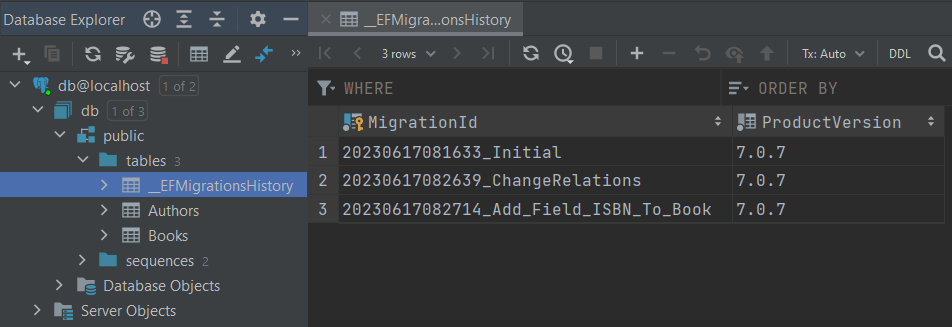

# Команды

### Добавить миграцию

Добавляет новую миграцию, но не коммитит:

```shell
dotnet ef migrations add Initial
```

### Применить миграцию(ции) к базе данных

Применить все миграции, которые еще не применены (они находятся в статусе `Pending`):

```shell
dotnet ef database update
```

После каждого обновления:

1. Изменения применяются к БД `->` **структура БД физически меняется** (если в миграции это заложено)
2. В БД в специальную таблицу `__EFMigrationsHistory` записывается название миграции, которое применено к БД:

&nbsp;&nbsp;&nbsp;&nbsp;

Если в `__EFMigrationsHistory` вручную удалить запись(си), то при следующем обновлении, ef попытается накатить миграции, запись о которых удалена.

### Откат миграции

Предположим к БД применены такие миграции:

```shell
dotnet ef migrations list

  20230617101026_Initial
  20230617105325_AddedFieldFullNameToEntityAuthor
  20230617105431_RelationManyToManyBetweenAuthorAndBook
```

**Откатываем** БД до Initial:

```shell
dotnet ef database update Initial

  Reverting migration '20230617105431_RelationManyToManyBetweenAuthorAndBook'.
  Reverting migration '20230617105325_AddedFieldFullNameToEntityAuthor'.
```

При этом:

1. Структура БД физически изменилась до состояния миграции Initial. В таблице `__EFMigrationsHistory` должна быть только одна запись - `20230617101026_Initial`
2. НО в проекте так и остались файлы миграций, которые откатились!!!

```shell
dotnet ef migrations list

  20230617101026_Initial
  20230617105325_AddedFieldFullNameToEntityAuthor (Pending)
  20230617105431_RelationManyToManyBetweenAuthorAndBook (Pending)
```

Поэтому **обязательно удаляем отмененные миграции** иначе они накатятся снова при следующем `database update`:

```shell
dotnet ef migrations remove

  Removing migration '20230617105431_RelationManyToManyBetweenAuthorAndBook'.
  Reverting the model snapshot.

dotnet ef migrations remove

  Removing migration '20230617105325_AddedFieldFullNameToEntityAuthor'.
  Reverting the model snapshot.
```

### Откат всех миграций, включая самую первую

```shell
dotnet ef database update 0
```

Но не забываем, что каждый файл миграции в проекте надо удалить командой `migrations remove` (много раз вызываем).
