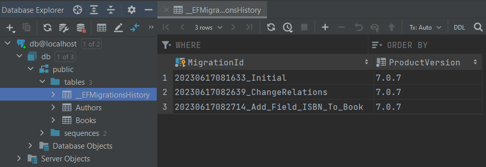

# Миграции

Механизм миграций и ручное создание БД через `dbContext.Database.EnsureCreated()` (подробнее см. [Create and Drop APIs](https://learn.microsoft.com/ru-ru/ef/core/managing-schemas/ensure-created)) совместно работают плохо. Если до миграций БД была создана при помощи `EnsureCreated`, то в таком случае самый простой способ перейти к миграциям - это удалить БД и повторно создать ее с помощью миграций.

Источники:

1. [Управление схемами баз данных](https://learn.microsoft.com/ru-ru/ef/core/managing-schemas/) > Миграции

## Подготовка

Инструменты для работы с миграциями:

1. Для Visual Studio - [The Package Manager Console (PMC) tools for Entity Framework Core](https://learn.microsoft.com/ru-ru/ef/core/cli/powershell)
2. Кроссплатформенно - [.NET Core CLI или The command-line interface (CLI) tools for Entity Framework Core](https://learn.microsoft.com/ru-ru/ef/core/cli/dotnet), +требуется пакет `Microsoft.EntityFrameworkCore.Design`

Перед запуском команд **переходят в папку проекта, где лежит DbContext**.  
Но в папку проекта с DbContext можно не переходить, а задать ее вручную:

```shell
dotnet ef --project Путь_До_Проекта_Где_Лежит_DbContext ТУТ_КОМАНДЫ
```

Может так оказаться, что **настройки для подключения к базе данных** лежат не том проекте, к которому относится DbContext.  
В таком случае надо будет указать путь до проекта с настройками подключения:

```shell
dotnet ef --startup-project Путь_До_Проекта_С_Настройками_Подключения_К_БазеДанных ТУТ_КОМАНДЫ
```

Если несколько контекстов, тогда можно **явно задать имя класса контекста**:

```shell
dotnet ef ТУТ_КОМАНДЫ --context AppDbContext
```

Можно задать **среду исполнения**:

```shell
dotnet ef database update -- --environment Production
```

Маркер `--` указывает рассматривать все последующие `dotnet ef` как аргументы, а не пытаться проанализировать их как параметры. Все дополнительные аргументы, не используемые `dotnet ef`, перенаправляются в приложение.

## Команды

### Добавить миграцию

Добавляет новую миграцию, но не коммитит:

```shell
dotnet ef migrations add Initial
```

### Применить миграцию(ции) к базе данных

Накатывает все миграции, которые еще не накачены (они находятся в статусе `Pending`):

```shell
dotnet ef database update
```

После каждого обновления:

1. Изменения применяются к БД `->` **структура БД физически меняется** (если в миграции это заложено)
2. В БД в специальную таблицу `__EFMigrationsHistory` записывается название миграции, которое применено к БД:

&nbsp;&nbsp;&nbsp;&nbsp;

Если в `__EFMigrationsHistory` вручную удалить запись(си), то при следующем обновлении, ef попытается накатить миграции, запись о которых удалена.

### Откат миграции

Предположим к БД применены такие миграции:

```shell
dotnet ef migrations list

  20230617101026_Initial
  20230617105325_AddedFieldFullNameToEntityAuthor
  20230617105431_RelationManyToManyBetweenAuthorAndBook
```

**Откатываем** БД до Initial:

```shell
dotnet ef database update Initial

  Reverting migration '20230617105431_RelationManyToManyBetweenAuthorAndBook'.
  Reverting migration '20230617105325_AddedFieldFullNameToEntityAuthor'.
```

При этом:

1. Структура БД физически изменилась до состояния миграции Initial. В таблице `__EFMigrationsHistory` должна быть только одна запись - `20230617101026_Initial`
2. НО в проекте так и остались файлы миграций, которые откатились!!!

```shell
dotnet ef migrations list

  20230617101026_Initial
  20230617105325_AddedFieldFullNameToEntityAuthor (Pending)
  20230617105431_RelationManyToManyBetweenAuthorAndBook (Pending)
```

Поэтому **обязательно удаляем отмененные миграции** иначе они накатятся снова при следующем `database update`:

```shell
dotnet ef migrations remove

  Removing migration '20230617105431_RelationManyToManyBetweenAuthorAndBook'.
  Reverting the model snapshot.

dotnet ef migrations remove

  Removing migration '20230617105325_AddedFieldFullNameToEntityAuthor'.
  Reverting the model snapshot.
```

### Откат всех миграций, включая самую первую

```shell
dotnet ef database update 0
```

Но не забываем, что каждый файл миграции в проекте надо удалить командой `migrations remove` (много раз вызываем).
