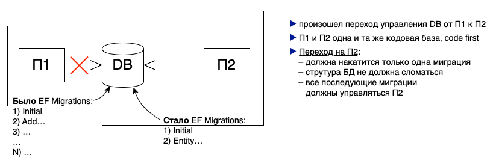

# Переход управления БД от Проекта1 к Проекту2. П1 и П2 одна кодовая база



Действия:

#### 0. Скопировать кодовую базу П1 в папку П2

#### 1. Удалить таблицу `__EFMigrationsHistory`

#### 2. Создать первую миграцию в П2

```shell
dotnet ef migrations add Initial
```

#### 3. В файле миграции `Initial` закомментировать содержимое методов Up и Down

#### 4. Применить миграцию `Initial`

```shell
dotnet ef database update
```

#### 5. Проверки

1. Должна появиться таблица `__EFMigrationsHistory` и в ней должна быть одна миграция - `Initial`
2. Проверить, что данные БД корректны

#### 4. В файле миграции `Initial` РАСкомментировать содержимое методов Up и Down

Комментировали только при первом накате миграции на БД, чтобы EF Core не вносил изменения в БД.

#### 5. Внести изменение в класс сущности, например, добавить поле. Создать и применить миграцию к БД

1. В таблице `__EFMigrationsHistory` должна появиться запись о второй миграции
2. Проверить, а накатилось ли в БД изменение 
