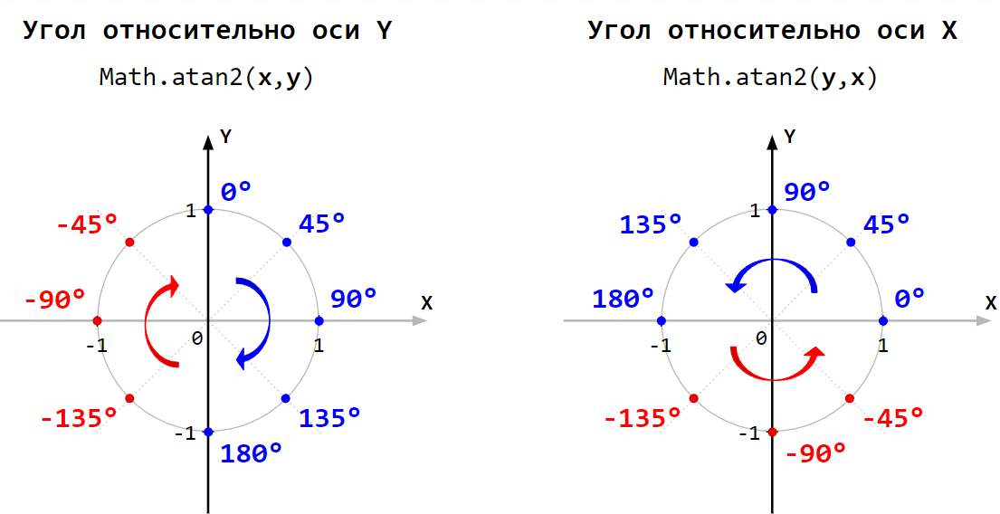
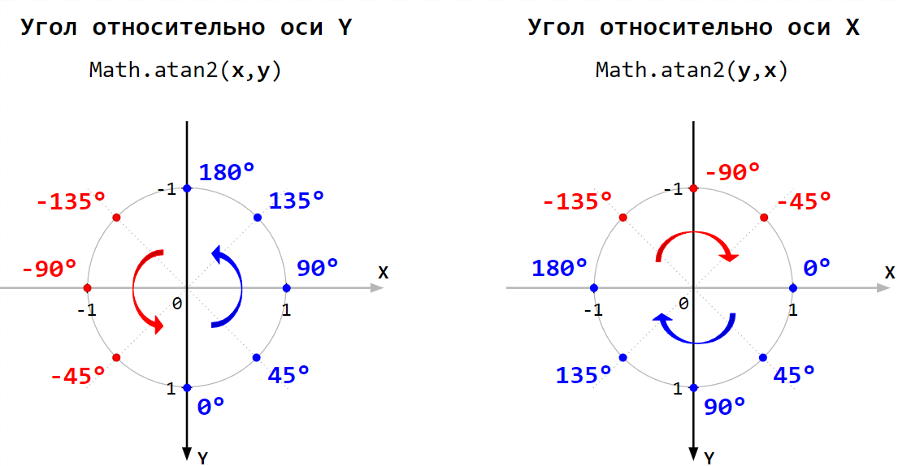

# Углы

[atan2](https://en.wikipedia.org/wiki/Atan2)

## atan2 – ось Y направлена вверх

## atan2 – ось Y направлена вниз

Этот случай более интересен для веб-разработки, т.к. там ось Y направлена вниз.

