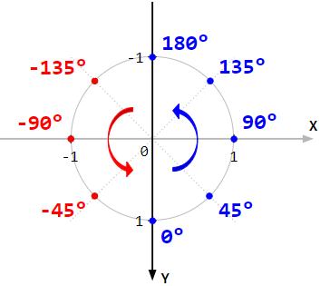

# Углы

[atan2](https://en.wikipedia.org/wiki/Atan2)

## atan2 – ось Y направлена вверх

## atan2 – ось Y направлена вниз

Этот случай более интересен для веб-разработки, т.к. в веб-разработке ось Y направлена вниз.  
Обычное использование: `atan2(x,y)` и `atan2(y,x)`:

Но интересно то, что комбинаций аргументов для функции atan2 может быть 8 штук.  
И эти комбинации покрывают все 4 стороны света по/против часовой стрелке.

Таблица комбинаций аргументов `atan2` для случая, когда:

- **ось Y направлена вниз ↓**
- **ось X направлена направо →**

| Сторона и направление | Аргументы `atan2` |                                       |
|-----------------------|-------------------|---------------------------------------|
| `North-Clockwise`     | `( x, -y )`       |  |
