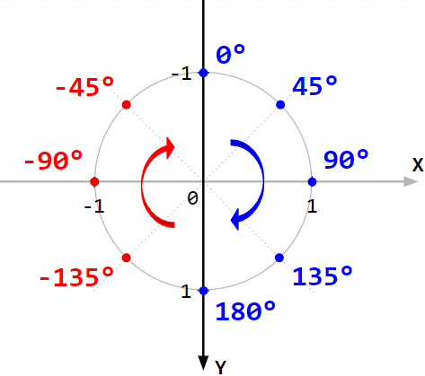
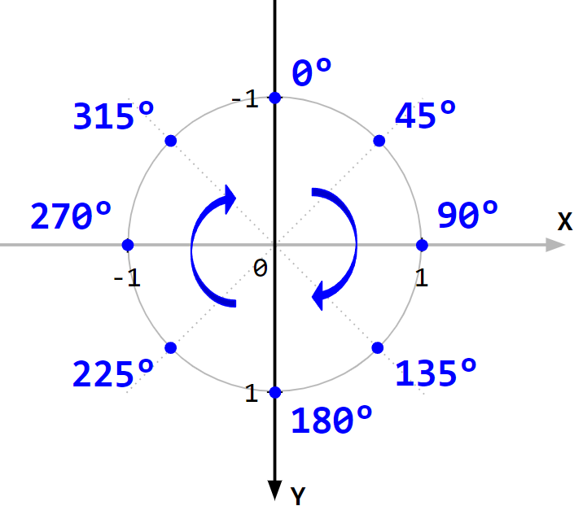
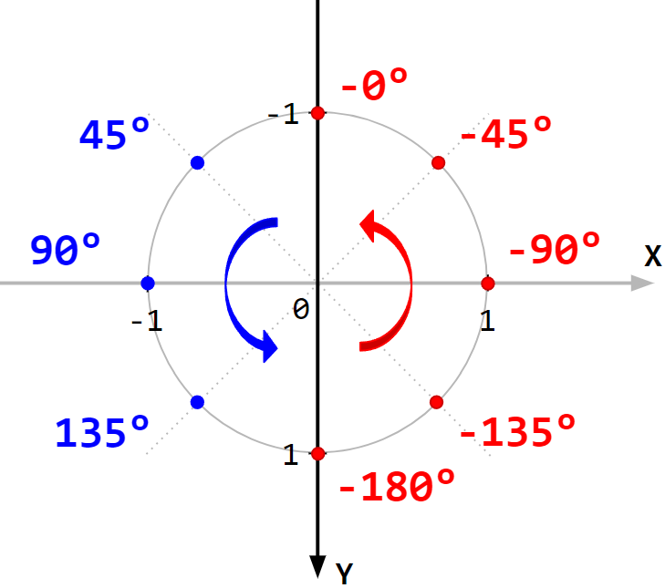
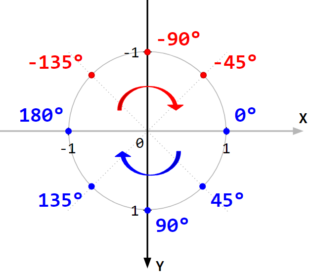
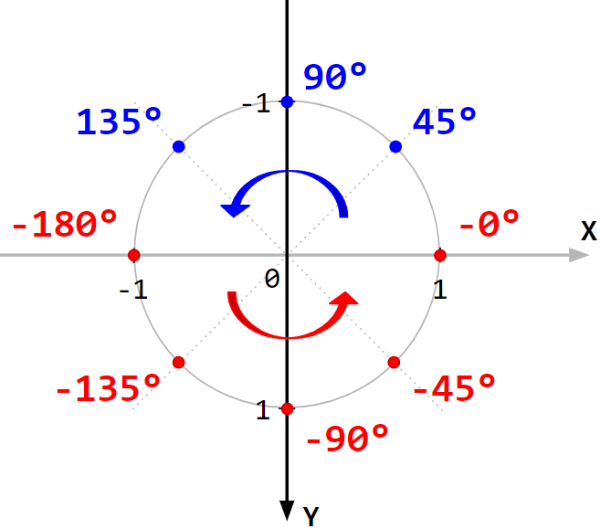
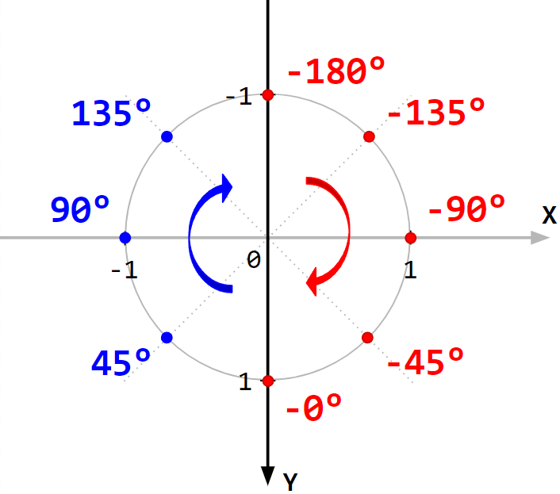
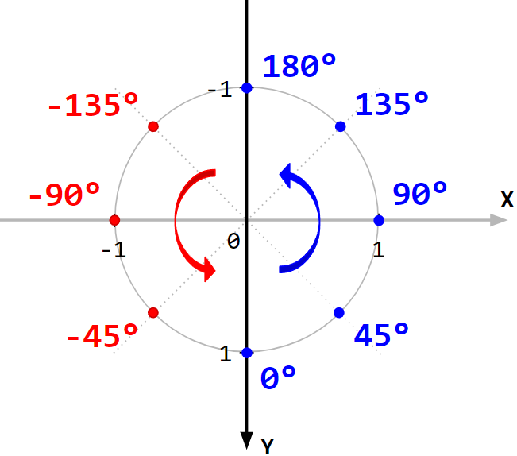
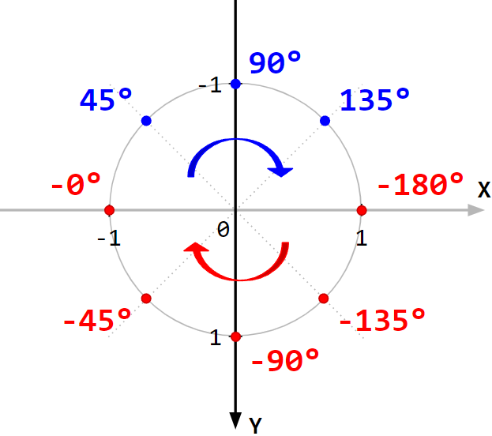
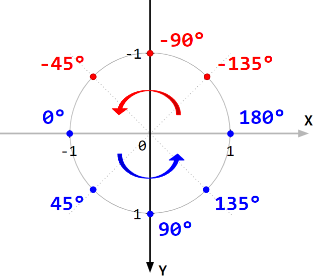

# Углы

[atan2](https://en.wikipedia.org/wiki/Atan2)

## atan2, когда ось Y направлена вниз (применительно к веб-разработке)

Обычное использование `atan2` – это `atan2(x,y)` и `atan2(y,x)`.  
Но интересно то, что комбинаций аргументов для функции `atan2` может быть 8 штук.  
И эти комбинации покрывают все 4 стороны света по/против часовой стрелке.

Ниже представлена таблица комбинаций аргументов `atan2` для случая, когда:

- ось Y направлена вниз ↓
- ось X направлена направо →

Обратите внимание, что если первый аргумент отрицательный, то `atan2` на краях принимает значение -0° и -180°.  
А если первый аргумент положительный, то 0° и 180°.

| Сторона и направление    | Аргументы `atan2` | Результат `atan2`                                          | Результат `atan2`,   помещенный в диапазон `[0; +360)`  |
|--------------------------|-------------------|------------------------------------------------------------|-------------------------------------------------------------|
| `North-Clockwise`        | `(  x, -y )`      |          |  |
| `North-CounterClockwise` | `( -x, -y )`      |  |                                                             |
| `East-Clockwise`         | `(  y,  x )`      |           |                                                             |
| `East-CounterClockwise`  | `( -y,  x )`      |   |                                                             |
| `South-Clockwise`        | `( -x,  y )`      |          |                                                             |
| `South-CounterClockwise` | `(  x,  y )`      |  |                                                             |
| `West-Clockwise`         | `( -y, -x )`      |           |                                                             |
| `West-CounterClockwise`  | `(  y, -x )`      |   |                                                             |

