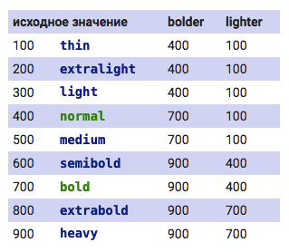

# `font-weight`

- по умолчанию большинство тегов имеет `font-weight: normal` и `font-style: normal;`
- опциональные значения `font-weight: bolder|lighter` изменяют жирность относительно родителя в обе стороны соответственно
- теги, которые включают bold: `<b>`, `<strong>`, `<h1> .. <h6>`
- теги, которые включают italic: `<i>`, `<em>`
