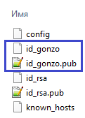

# Multi remote repo

Когда надо один проект заливать в несколько репозиториев по ssh.

## Сгенерить private/public ключи ([link](https://docs.github.com/en/authentication/connecting-to-github-with-ssh/generating-a-new-ssh-key-and-adding-it-to-the-ssh-agent#generating-a-new-ssh-key)):

```shell
C:\Users\FatPinkRabbit>cd .ssh
C:\Users\FatPinkRabbit\.ssh>ssh-keygen -t ed25519
```

## Добавить содержимое `public` ключа в аккаунт Git-хостинга

## Зарегать в конфиге

В папке `~/.ssh` у меня есть два ключа:



Регистрирую `private` ключ в конфиге `~/.ssh/config`:

```
Host github-gonzobard
  HostName github.com
  IdentityFile c:\Users\FatPinkRabbit\.ssh\id_gonzo
```

## Проверка

```shell
ssh -T git@github-gonzobard
```

## Наконец использовать в IDE


# Links

- [Using multiple GitHub accounts with ssh-keys](https://gist.github.com/oanhnn/80a89405ab9023894df7)
