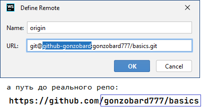

# Multi remote repo

Когда надо один проект заливать на несколько репозиториев по ssh.

### 1. Сгенерить public/private пару ключей ([link](https://docs.github.com/en/authentication/connecting-to-github-with-ssh/generating-a-new-ssh-key-and-adding-it-to-the-ssh-agent#generating-a-new-ssh-key)):

```shell
ssh-keygen -t ed25519
```

оба файла надо положить в папку `~/.ssh`

### 2. Добавить содержимое public ключа в аккаунт git-хостинга

### 3. Настроить использование

В папке `~/.ssh` у меня есть два ключа:


Регистрирую приватный ключ в конфиге `~/.ssh/config`:

```
Host github-gonzobard
  HostName github.com
  IdentityFile c:\Users\FatPinkRabbit\.ssh\id_gonzo
```

Использую регистрацию в IDE:




# Links

- [Using multiple GitHub accounts with ssh-keys](https://gist.github.com/oanhnn/80a89405ab9023894df7)
