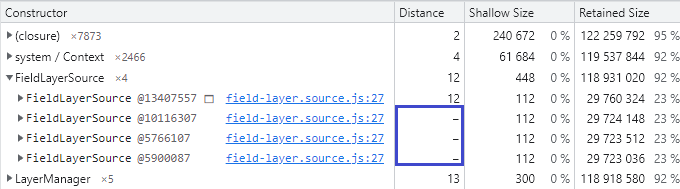
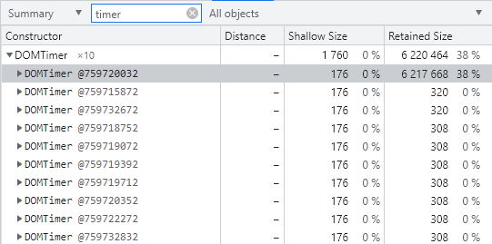

- ["garbage.collect()" by Андрей Роенко](https://habr.com/ru/company/oleg-bunin/blog/433318/)
- ["Trash talk: the Orinoco garbage collector" by Peter Marshall](https://v8.dev/blog/trash-talk)
- [Chrome DevTools - Memory](https://developer.chrome.com/docs/devtools/#memory)
- [Description of Tools for developers trying to understand memory usage](https://chromium.googlesource.com/chromium/src/+/refs/heads/main/docs/memory/tools.md)
    - [MemoryInfra - where memory is being used in your system](https://chromium.googlesource.com/chromium/src/+/refs/heads/main/docs/memory-infra)

## Терминология

**Shared memory** - совместная память процесса - объем используемой процессом физической памяти, которая может использоваться совместно с другими процессами.  
**Private memory** - собственная память процесса - объем используемой процессом физической памяти, которая не может использоваться другими процессами.  
**JavaScript memory** - он же JS Heap - объем физической памяти, занимаемой js вообще и живыми объектами в частности.  
**Memory footprint** - предположительно включает в себя Private memory и JS Heap. Но это неточно.

# Известные кейсы / подходы

## Освобождение занимаемых ресурсов

- `setInterval / clearInterval(intervalID)`; `setTimeout / clearTimeout(timeoutID)`;
- `createObjectURL(obj) / revokeObjectURL(url)` – [...As long as the mapping exist the Blob can’t be garbage collected](https://w3c.github.io/FileAPI/#url-intro);
- `addEventListener / removeEventListener`;
- `Subscription.unsubscribe()`, `takeUntil`, `takeWhile`, `take`, `first`;
- `ImageBitmap.close()`;
- `indexDb.close()`[...Set connection’s close pending flag to true](https://w3c.github.io/IndexedDB/#close-a-database-connection);
- WebGL: `create`/`delete` `Program/Shader/Buffer/Texture/etc` – [...Mark for deletion the texture object contained in the passed WebGLTexture](https://www.khronos.org/registry/webgl/specs/latest/1.0/#5.14.8).

## JS Heap

### `new ReplaySubject()`, `shareReplay()`

При таком использовании: `new ReplaySubject()`, `shareReplay()` – в `bufferSize` назначится `Infinity`.  
B долгоживущих объектах это гарантированно приведет к росту JS Heap.

### Объект без корня

Если значение в колонке [Distance](https://developer.chrome.com/docs/devtools/memory-problems/memory-101/#retained_size) отлично от числового, то объект повис в каком-то контексте и GC не сможет его убрать:

### Таймер удерживает большой ресурс

Таймеры `setInterval`, `setTimeout` всегда повисают в root-контексте (`Window`, `DedicatedWorkerGlobalScope` и т.д.), поэтому для них не важен Distance.  
Если в списке активных таймеров присутствует таймер, удерживающий большой кусок памяти, то вероятно в нем произошла утечка – надо в коде найти этот таймер и в нужный момент вызвать для него `clearTimeout`:

Таймер может быть скрыт внутри используемой в проекте библиотеки.  
Например, [time based operators](https://www.learnrxjs.io/learn-rxjs/concepts/time-based-operators-comparison) в rxjs используют таймеры. И, чтобы освободить повисший в time based operator'е ресурс, надо явно отписаться от подписки.

## Memory footprint

DevTools активно создает объекты, которые могут занимать немало места, поэтому иногда есть смысл производить замер при закрытом DevTools.

### Transferable

При обмене между контекстами (например, обмен Воркер `<->` Main-thread) в `.postMessage` вторым аргументом можно передать массив объектов, на которые передаются права собственности контексту-получателю.  
Одной из причин значительного роста Memory footprint по отношению к росту JS Heap(либо при отсутствии его роста) является то, что контекст-отправитель при вызове `.postMessage` передал права не на все [Transferable](https://developer.mozilla.org/en-US/docs/Glossary/Transferable_objects#supported_objects) объекты исходящего сообщения.
