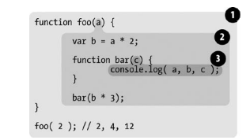

1. фаза **Компиляция кода**. Компилятор находит и связывает все объявления с соответствующими областями видимости (сначала объявления функций, затем  `var` переменных). При этом происходит поднятие объявлений (hoisting) в рамках блока, либо в рамках глобального контекста.
2. фаза **Исполнение кода**

## Области видимости

**Функциональная область видимости** – это принадлежность переменных и функций объявленных в блоке функции `function(arg1, arg2, ...) {..}` + аргументы функции также не выходят за границу функциональной области видимости.  

**Блочная область видимости** – это принадлежность _переменных_ (объявленых через `let` или `const`) произвольному блоку `{..}`. Функции же из произвольного блока поднимаются во внешнюю область видимости.

**Лексическая область видимости** определяется на стадии лексического анализа. Другими словами, она определяется тем, где вы разместили переменные, функции и блоки видимости во время написания программы.



В этом примере существуют три области видимости:

- Область (1) охватывает глобальную область видимости и содержит всего один идентификатор: `foo`.
- Область (2) охватывает область видимости `foo` и содержит три идентификатора: `a`, `bar` и `b`.
- Область (3) охватывает область видимости `bar` и включает один идентификатор: `c`.

Область видимости `bar` полностью содержится внутри области видимости `foo`, потому что (и только по этой причине) мы решили определить функцию `bar` именно здесь.  
Неважно, _где_ вызывается функция, и даже _как_ она вызывается – **лексическая область видимости функции** определяется только тем, в каком месте программы эта функция была объявлена.

Так в нашем примере лексической областью видимости функции `bar` является: область (3) + область (2).    
Когда движек выполняет команду `console.log(a, b, c)`, то поиск идентификаторов в областях видимости идет в таком порядке: в (3) находит `c` ➜ в (2) находит `a` и `b`.

## Замыкания

**Замыкание** – это способность функции запоминать свою лексическую область видимости и обращаться к ней, даже когда функция вызывается за пределами своей лексической области видимости.

## Checks

```js
a = 2;
var a;
console.log(a);
```

```js
console.log(a);
var a = 2;
```

```js
if (true) {
  console.log(foo);
  const foo = 123;
}
```

```js
function foo() {
  var a = 123;
  console.log(a);
}
foo();
console.log(a);
```

```js
if (true) {
  var a = 123;
  console.log('if', a);
}
console.log('global', a);
```

```js
if (true) {
  console.log(foo(1));
  function foo(a) {
    return a * 10;
  }
}
console.log(foo(2));
```

```js
for (let i = 1; i <= 5; i++) { // и другой вариант, где: var i = 1 
  const timerId = setTimeout(() => {
    console.log(i);
  }, i * 1000);
}
```
