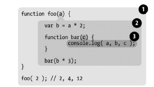

Читал книгу [You Don't Know JS: Scope & Closures](https://www.amazon.com/gp/product/1449335586/ref=dbs_a_def_rwt_bibl_vppi_i8) и конспектировал.  

# Области видимости и замыкания

1. Фаза **Компиляция**:
    1. **Лексический анализ** – разбиение последовательности символов на осмысленные (с точки зрения языка) фрагменты, называемые _токенами_.
    2. Преобразорвание массива токенов в дерево вложенных элементов, которые в совокупности представляют грамматическую структуру программы. Это дерево называется **Abstract Syntax Tree** - [AST](https://astexplorer.net/).
    3. Создание **иерархии областей видимости**. При этом происходит поднятие объявлений (hoisting) – сначала поднимаются объявления функций, затем  `var` переменных; в процессе поднятия идентификаторы могут переопределяться.
    4. Поиск синтаксических ошибок.
    5. Компиляция байт-кода для движка.
2. Фаза **Исполнение**:
    1. В процессе исполнения байт-кода движек постоянно взаимодействует с соответствующими областями видимости.

## Области видимости

В общем случае **область видимости** – это набор правил, определяющих, где и как движек будет осуществлять поиск идентификаторов.

**Функциональная область видимости** – для любой функции `function(arg1, arg2, ...) {..}` все переменные и функции, объявленные внутри блока `{..}`, + ее аргументы попадают в функциональную область видимости этой функции и недоступны за ее границей.

**Блочная область видимости** – это принадлежность переменных, объявленых через `let` или `const`, произвольному блоку `{..}`. Лучше избегать объявление функций в произвольных блоках, либо не вызывать их вне блоков, т.к. поведение может быть неожиданным.

**Лексическая область видимости** определяется на стадии лексического анализа. Другими словами, она определяется тем, где вы разместили переменные, функции и блоки видимости во время написания программы.

В этом примере существуют три области видимости:

- Область (1) охватывает глобальную область видимости и содержит всего один идентификатор: `foo`.
- Область (2) охватывает область видимости `foo` и содержит три идентификатора: `a`, `bar` и `b`.
- Область (3) охватывает область видимости `bar` и включает один идентификатор: `c`.

Область видимости `bar` полностью содержится внутри области видимости `foo`, потому что (и только по этой причине) мы решили определить функцию `bar` именно здесь.  
Неважно, _где_ вызывается функция, и даже _как_ она вызывается – **лексическая область видимости функции** определяется только тем, в каком месте программы эта функция была объявлена.

Так в нашем примере лексической областью видимости функции `bar` является: область (3) + область (2) + область (1).    
Когда движек выполняет команду `console.log(a, b, c)`, то поиск идентификаторов в областях видимости идет в таком порядке: в (3) находит `c` ➜ в (2) находит `a` и `b`.

## Замыкания

**Замыкание** – это способность функции запоминать свою лексическую область видимости и обращаться к ней, даже когда функция вызывается за пределами своей лексической области видимости.
