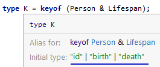
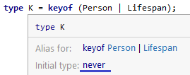

# Система типов TypeScript

## Думать о типах как о множестве значений (наборе значений)

| TypeScript term       | Set term               |
|-----------------------|------------------------|
| `never`               | ∅ (empty set)          |
| Literal type          | Single element set     |
| Value assignable to T | Value ∈ T (member of)  |
| T1 assignable to T2   | T1 ⊆ T2 (subset of)    |
| T1 extends T2         | T1 ⊆ T2 (subset of)    |
| T1 &#124; T2          | T1 ∪ T2 (union)        |
| T1 & T2               | T1 ∩ T2 (intersection) |
| `unknown`             | Universal set          |

Самое маленькое множество – это пустое множество, в котором нет значений – ∅. В TypeScript оно соответствует типу `never`.

```typescript
const x: never = 'A';
// Type 'string' is not assignable to type 'never'.
```

Следующие наименьшие множества – это те, которые содержат одиночные значения. Они соответствуют литеральным типам в TypeScript, также известным как unit types:

```typescript
type A = 'A';
type B = 'B';
type Twelve = 12;
```

Один тип может объединять в себе несколько множеств:

```typescript
type AB = 'A' | 'B';
type AB12 = 'A' | 'B' | 12;
type ABnumber = 'A' | 'B' | number;
```

В сообщениях об ошибках в TypeScript часто фигурирует слово "assignable" (может быть назначен). В контексте множеств значений это означает:

- The Value is a **member of** the Set – для отношений между значением и типом;
- The SetB is a **subset of** the SetA – для отношений между двумя типами.

Почти все, что делает средство проверки типов, – это проверяет, является ли одно множество подмножеством другого:

```typescript
const a: AB = 'A'; // OK, value "A" is a member of {"A" | "B"} set
const ab: AB = Math.random() < 0.5 ? 'A' : 'B'; // OK, set {"A" | "B"} is a subset of {"A" | "B"} set
const ab12: AB12 = ab; // OK, set {"A" | "B"} is a subset of {"A" | "B" | 12} set
const c: ABnumber = 'C'; // value "C" is not a member of {"A" | "B" | number} set
// Type '"C"' is not assignable to type 'ABnumber'
declare let twelve: AB12;
const back: AB = twelve; // set {"A" | "B" | 12} is not a subset of {"A" | "B"} set
// Type 'AB12' is not assignable to type 'AB'
// Type '12' is not assignable to type 'AB'
```

## Объекты

### Структурная типизация

Тип объекта в TypeScript не видит разницы между простыми объектами (вроде созданных с помощью `{}`) и более сложными (созданными с помощью `new`). Так и было задумано – TypeScript **структурно типизирован**. При структурной типизации интересуют только конкретные свойства объекта и их тип, а не имя объекта (номинальная типизация) или способ его создания.   
Например, код ниже успешно пройдет проверку по типам и выведет в консоль id переданных объектов, т.к. объекты book и person могут быть назначены типу Identified (assignable to type):

```typescript
interface Identified {
    id: string;
}

const book = {
    id: 'B00005AVXB',
    author: 'Stephen King',
    title: 'Dreamcatcher',
}

let person = {
    name: 'John',
    age: 18,
    id: '35',
}

function print(obj: Identified) {
    console.log(obj.id);
}

print(book); // "B00005AVXB"
print(person); // "35"
```

### Пересечение и объединение

Рассмотрим пример:

```typescript
interface Person {
    id: string;
}

interface Lifespan {
    birth: Date;
    death?: Date;
}

type Intersection = Person & Lifespan;
type Union = Person | Lifespan;
```

#### Пересечение

Для пересечения TypeScript будет ожидать следующий тип:

```typescript
type Intersection = { // = Person & Lifespan;
    id: string;
    birth: Date;
    death?: Date;
}
```

То есть под тип `Intersection` подпадет любой объект, имеющий все обязательные свойства `Person` _и_ `Lifespan` _одновременно_. Поэтому деструктуризация всех полей не вызовет ошибок при проверке типов:

```typescript
const obj = {
    id: '123',
    birth: new Date,
};
let personLifespan: Intersection = obj;
const {id, birth, death} = personLifespan;
```



#### Объединение

Для объединения TypeScript будет ожидать объект, имеющий все обязательные свойства `Person` _либо_ `Lifespan`, но никак не одновременно оба. Например:

```typescript
const obj = {
    id: '123',
    birth: new Date,
};
let personLifespan: Union = obj; //  (1) ОК, т.к. состав полей подходит и `Person` и `Lifespan` одновременно
const {id, birth, death} = personLifespan; // (2) Type error
// Property 'id' does not exist on type 'Union'.
// Property 'birth' does not exist on type 'Union'.
// Property 'death' does not exist on type 'Union'.
```

TypeScript выдает ошибку при деструктуризации, т.к. не может понять к какому типу отнести объект:



Вот такой код уже не будет выдавать ошибок:

```typescript
const obj = {
    birth: new Date,
};
let personLifespan: Union = obj;
const {birth, death} = personLifespan; // TypeScript понимает, что obj подходит для интерфейса Lifespan
```
